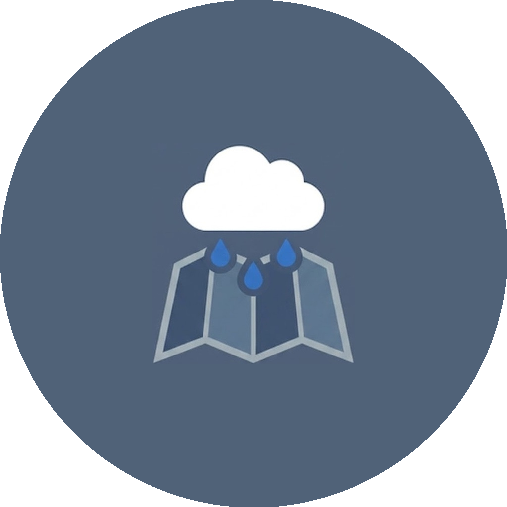
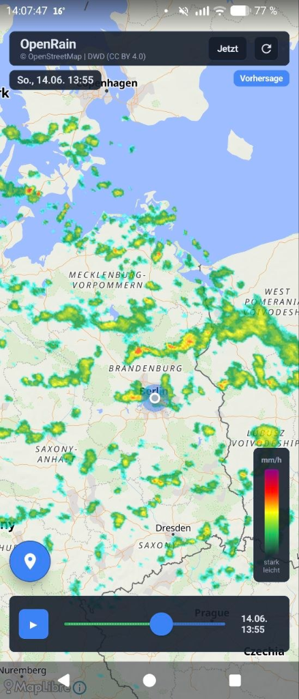
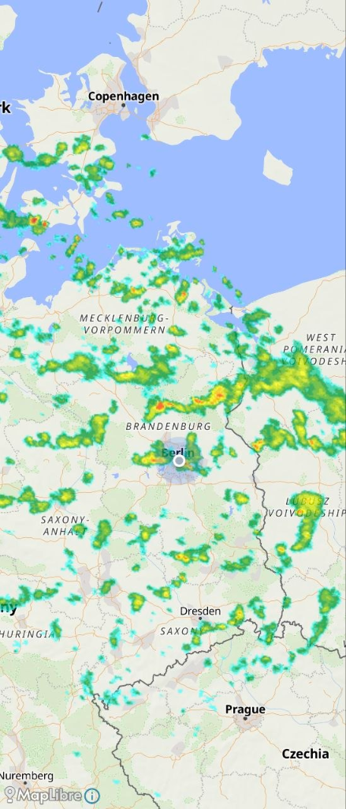
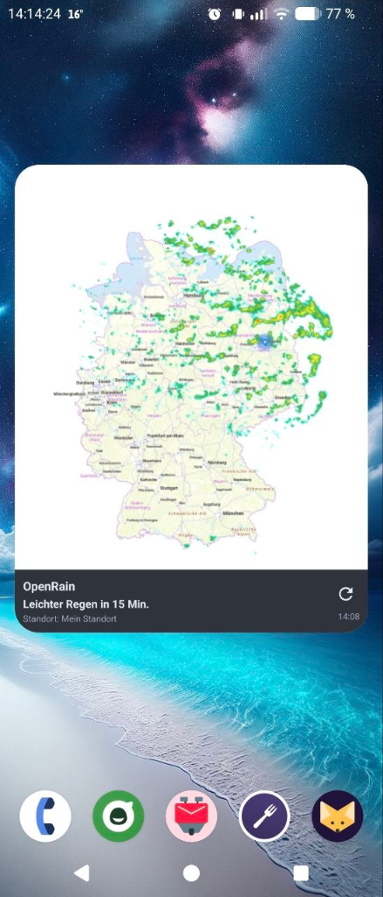

# OpenRain — DWD Rain Radar Mobile App

<p align="center">
  
</p>

This mobile Android app (**OpenRain**) is based on the KDE Plasma DWD rain radar widget and was implemented entirely in **Kotlin & Jetpack Compose** using **Osmdroid** for interactive OpenStreetMap maps.

## Features

- **Interactive Map** — Seamless OpenStreetMap integration with smooth zooming and panning.
- **Real-Time DWD Radar Overlay** — Animated, transparent rain radar directly from the DWD WMS.
- **Smooth Preloading Technology** — All radar frames are loaded in the background and cached to ensure a completely smooth animation without flickering.
- **History & Forecast** — Toggle between past rain radar records and the 2-hour DWD precipitation forecast.
- **Location Tracking** — Jump directly to your own location (requires GPS permission).
- **Modern Design** — Premium dark-mode interface with a minimalist color palette and integrated intensity legend.

## Screenshots

<p align="center">
  
  
  
</p>

## Structure & Architecture

The app follows modern Android architecture guidelines (MVVM) and optionally utilizes an optimization server:
- **[DwdWmsClient.kt](file:///home/will/ownProjects/kotlin-rain-radar/app/src/main/java/com/example/rainradar/data/DwdWmsClient.kt)** — Calculates the 5-minute time windows dynamically, manages the optimized WebP proxy downloads, and handles the direct DWD WMS fallback in case of server failure.
- **[RadarViewModel.kt](file:///home/will/ownProjects/kotlin-rain-radar/app/src/main/java/com/example/rainradar/ui/RadarViewModel.kt)** — Manages the state (animation, time steps, play/pause) using secure Kotlin Coroutines within the `viewModelScope`.
- **[RadarMapView.kt](file:///home/will/ownProjects/kotlin-rain-radar/app/src/main/java/com/example/rainradar/ui/components/RadarMapView.kt)** — Manages the map overlays (bypasses the local pixel cleanup if WebP images were loaded from the proxy).
- **[RadarScreen.kt](file:///home/will/ownProjects/kotlin-rain-radar/app/src/main/java/com/example/rainradar/ui/RadarScreen.kt)** — Declarative Jetpack Compose layout using Material 3 components.
- **`/server` (Ktor Server)** — Standalone Kotlin server that fetches PNG frames from the DWD, cleans them up (removes background/borders), converts them to WebP, and serves them via RAM + disk cache.

## Running and Testing

1. Open the project directory `kotlin-rain-radar` in **Android Studio**.
2. Let Gradle sync the project.
3. Start the app on an Android emulator or a physical device (requires Android API 26+).

---

## Building the APK (Build APK)

There are two reliable ways to generate the installation file (`.apk`) for your Android device:

### Method 1: Using the Android Studio UI (Recommended)
This method is the safest, as Android Studio automatically uses its own compatible Java Runtime (JBR), avoiding conflicts with newer Java versions on your operating system (e.g., OpenJDK 26 on Arch Linux).

1. Open the project in **Android Studio**.
2. In the top menu bar, click on **Build** -> **Build Bundle(s) / APK(s)** -> **Build APK(s)**.
3. Android Studio compiles the app. Once the process is complete, a pop-up window appears in the bottom right corner.
4. Click on **locate** in the pop-up. Your file manager will open directly in the directory containing the finished APK file (`app-debug.apk`).
   - *Alternatively, you can find the file at:* `app/build/outputs/apk/debug/app-debug.apk`

### Method 2: Via Terminal (Command Line)

You can start the build directly in the terminal:

```bash
./gradlew assembleDebug
```

*(Note: The build requires Java 17. If you have a newer default Java version active on your operating system, e.g., Java 26, and encounter compilation errors, you can prepend the Java 17 path to the command, e.g.: `JAVA_HOME=/usr/lib/jvm/java-17-openjdk/ ./gradlew assembleDebug`)*

The compiled APK file is located at:
`app/build/outputs/apk/debug/app-debug.apk`

---

## Setting up the Server Proxy (VPS / Remote Server)

The server component (`/server`) is a standalone Kotlin JVM project and can be run on any Linux server (e.g., a VPS) via Docker or directly.

### Method 1: Deployment via Docker Compose (Recommended)

1. Copy the `server/` directory to your remote server (e.g., via `git clone` or `scp`).
2. Ensure **Docker** and **Docker Compose** are installed on the server.
3. Navigate to the `server/` directory on the server and start the container in the background:
   ```bash
   docker compose up -d --build
   ```
4. The server will now be accessible on port `8080`. The cleaned and converted WebP images are cached persistently in the local `./cache` directory.

### Method 2: Running Directly (via Gradle)

Requires Java JDK 17 (or newer) installed on the system:
```bash
cd server
./gradlew run
```

### Connecting the App to the Server

1. Open the file [DwdWmsClient.kt](file:///home/will/ownProjects/kotlin-rain-radar/app/src/main/java/com/example/rainradar/data/DwdWmsClient.kt) in Android Studio.
2. Change the value of `PROXY_URL` to the IP address or domain of your server:
   ```kotlin
   const val PROXY_URL = "http://YOUR_SERVER_IP:8080/radar"
   ```
3. *(Note: To disable the proxy and connect the app directly to the DWD server again, simply set `PROXY_URL` to an empty string `""`)*.
4. Rebuild the APK (see the "Building the APK" section) and install it on your device.
